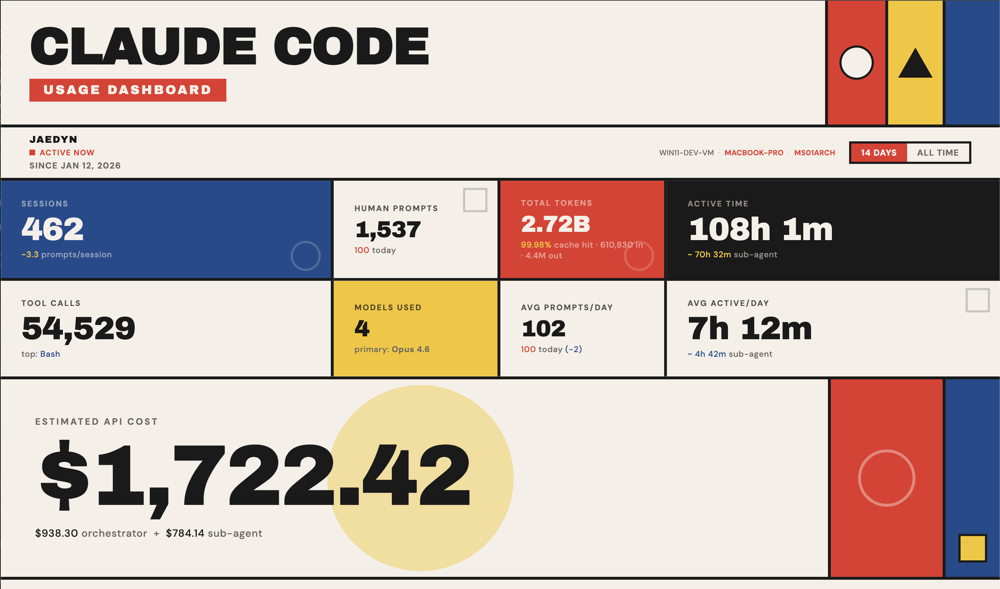

# Tokenfold

Analytics dashboard for [Claude Code](https://docs.anthropic.com/en/docs/claude-code) that aggregates usage across multiple machines into a single view. Track sessions, token costs, model usage, active coding time, and more.

A lightweight client runs on each machine (via cron or launchd), pushing session events to a central server. The server deduplicates, stores everything in SQLite, and serves a Bauhaus-styled dashboard.



## Features

- Aggregate token data from every device into one dashboard
- Per-model, per-day, per-project cost breakdown with live LiteLLM pricing
- Active time tracking: thinking time, tool execution, main sessions, subagents
- Per-machine stats for prompts, tokens, and costs
- Weekly budget utilization gauge via Anthropic's OAuth API
- 24-hour hourly activity heatmap
- Stdlib-only Python client, no pip install needed
- Message content is stripped before sending; only metadata and token counts are transmitted

## Quick Start

### 1. Deploy the server

```bash
git clone https://github.com/jaedync/tokenfold.git
cd tokenfold
cp .env.example .env
# Edit .env - set STATS_API_KEY to a random secret
docker compose up -d
```

The dashboard is now at `http://localhost:5000`.

### 2. Set up the client

Copy `client/claude-stats-push.py` to each machine you use Claude Code on.

**Linux (cron):**

```bash
# Copy the script
cp client/claude-stats-push.py ~/tokenfold-push.py

# Add to crontab (runs every 5 minutes)
(crontab -l 2>/dev/null; echo "*/5 * * * * TOKENFOLD_URL=https://your-server.example.com TOKENFOLD_API_KEY=your-secret python3 ~/tokenfold-push.py") | crontab -
```

**macOS (launchd):**

```bash
# Copy the script
cp client/claude-stats-push.py /usr/local/bin/tokenfold-push.py

# Edit the plist - set TOKENFOLD_URL and TOKENFOLD_API_KEY
cp client/com.tokenfold.push.plist ~/Library/LaunchAgents/
# Edit ~/Library/LaunchAgents/com.tokenfold.push.plist with your server URL and API key

# Load
launchctl load ~/Library/LaunchAgents/com.tokenfold.push.plist
```

### Client Environment Variables

| Variable | Default | Description |
|----------|---------|-------------|
| `TOKENFOLD_URL` | *(required)* | Server URL (e.g. `https://your-server.example.com`) |
| `TOKENFOLD_API_KEY` | *(required)* | API key matching the server's `STATS_API_KEY` |
| `TOKENFOLD_MACHINE` | hostname | Display name for this machine |
| `TOKENFOLD_VERBOSE` | `0` | Set to `1` for debug logging to stderr |
| `TOKENFOLD_CURSOR` | `~/.tokenfold-cursor.json` | Cursor file path (tracks sync progress) |

Legacy `CLAUDE_STATS_*` env vars are still supported as fallbacks.

### Server Environment Variables

| Variable | Default | Description |
|----------|---------|-------------|
| `STATS_API_KEY` | *(required)* | API key for authenticating client pushes |
| `TZ` | `America/Chicago` | Timezone for daily bucketing |
| `DB_PATH` | `/app/data/tokenfold.db` | SQLite database path |
| `STATS_OWNER` | *(empty)* | Display name shown on the dashboard |

## Architecture

```
Claude Code CLI  ->  ~/.claude/projects/**/*.jsonl
                        |
              client/claude-stats-push.py  (cron, every 5min)
                        |
              POST /api/ingest  (X-API-Key auth, batches of 2000)
                        |
              app/ingest.py  (parse, deduplicate by UUID)
                        |
              SQLite  (WAL mode, events + tool_uses tables)
                        |
              app/aggregator.py  (cached rebuild on invalidation)
                        |
              GET /  (Bauhaus HTML dashboard)
              GET /api/stats  (JSON API)
```

## API Endpoints

| Method | Path | Auth | Description |
|--------|------|------|-------------|
| `GET` | `/` | No | HTML dashboard |
| `GET` | `/api/stats` | No | Full stats JSON |
| `GET` | `/api/stats/version` | No | Cache version (for polling) |
| `POST` | `/api/ingest` | `X-API-Key` | Ingest session events |
| `POST` | `/api/usage` | `X-API-Key` | Push OAuth usage data |
| `GET` | `/health` | No | Health check |

## Development

```bash
pip install -r requirements.txt
STATS_API_KEY=test uvicorn app.main:app --reload --host 127.0.0.1 --port 5000
```

## License

MIT
